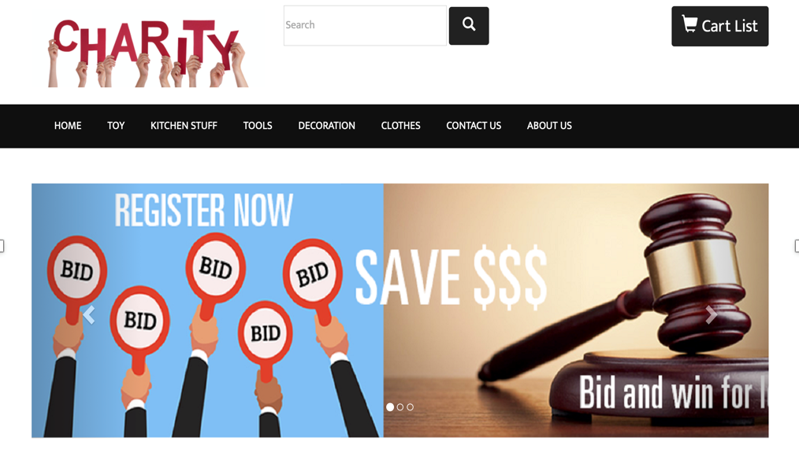
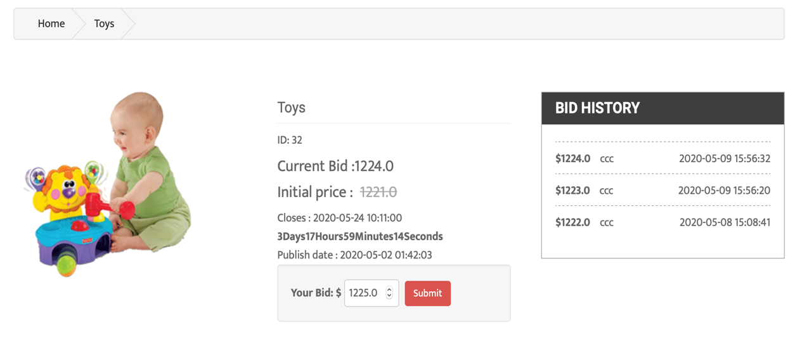
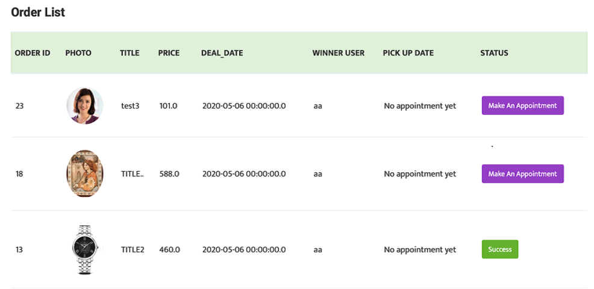
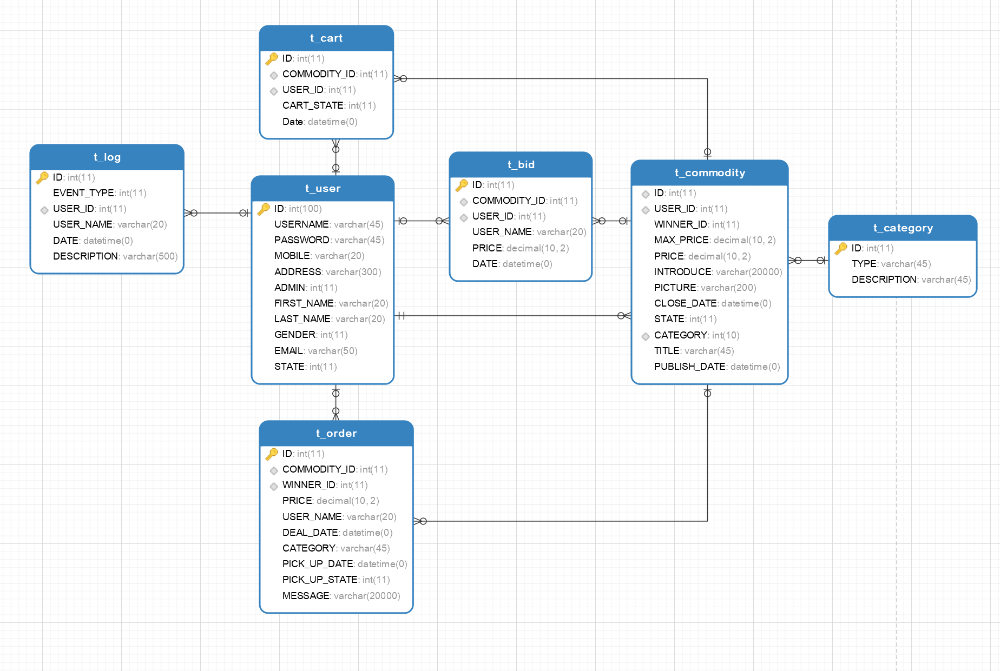

# CharityOnlineStore

**INTRODUCTION**

The purpose of this project is to create a website for charity second-hand stores which the information construction is backward. To help them improve transaction efficiency and increase turnover and income. 

In this way, the information construction of these stores can be improved to better promote the development of community services. 

There are two members in our team. Cong Shang was responsible for the product design,back-end, front-end development, testing and documentation. Guozhi Yin was responsible for product design, database, testing and documentation.

 **DEVELOPMENT**

The project team investigated and collected requirements from the client. The methodology which was chosen by the project team is prototyping. Through this method, the client can intuitively understand the functional design of the product and reduce the deviation in the demand communication. 

The project team used Microsoft Project to manage the entire project process. From the beginning of the planning phase, a clear set of objectives for each phase to be output, as well as the tasks and responsibilities of each member.

The project team transformed the requirements into the functions of the product and carried out product design. A total of 14 functional modules were designed. After confirming the product function with the client, the project team carried out system analysis and design, test plan and test case design.

In this project, the project team uses Eclipse as the development tool. The team choose MYSQL as the database.  The version management tool uses GIT. With the development process, the code is constantly uploaded to GitHub. Considering the project cost, all development tools are free.

After development, the project team conducted integration testing, system testing, and user acceptance testing of the system. All defects and bugs found in the tests were fixed. 

 **CONCLUSION**

After completing 5 milestones, the system met all the requirements requested by the client. The project team has completed the client’s training and the delivery of relevant documents, and received the client’s receipt and confirmation email, so the project can be completed normally. 

Through this project, the project team learned some experience in risk management, time management, teamwork, documentation and technology. These valuable experiences will be of great help to our future projects

## Technologies:

- Backend: **JAVA,  Spring , MyBatis, Web socket, Maven**
- Frontend: **HTML5, CSS , JAVASCRIPT, AJAX， **
- Database: **MySQL, MongoDB **
- CI & CD: **Jenkins**
- Testing:
  - Unit Testing:
    - Back end: **JUnit**
  - Integration Testing: 
  - System  Testing:
- Design tools: **Axure ,Visio**
- OS：**RHEL7(Red Hat Enterprise Linux)**
-  (Upgrading to a new version: **Spring boot, RESTful, Thymeleaf, druid,Kafka/RabbitMQ, Docker ,REACT**  )

##  Methodology

- Combine with **Prototype** methodology and  **Waterfall** methodology .

## Communication tools:

- WeChat
- Zoom

## Preview:

|              |                                                  |
| ------------ | ------------------------------------------------ |
| Home   page  |     |
| Auction Page |  |
| Order page   |    |

##  Data Model

### Data Dictionary

- ### [Data Dictionary](/03_Design/32_Database Design)